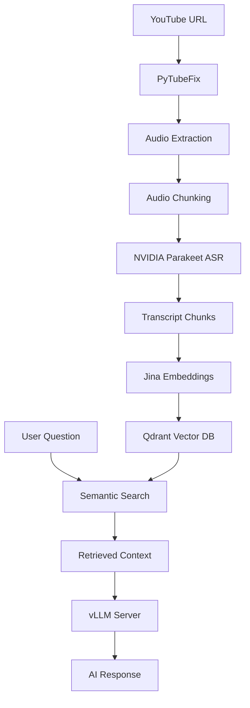

# 🎬 YouTube Audio Analysis & Chat

An intelligent YouTube video analysis tool that transcribes audio content and enables interactive Q&A using AI. Perfect for extracting insights from educational videos, podcasts, lectures, and more!

## ✨ Features

- 🎥 **YouTube Video Processing**: Download and extract audio from any YouTube video
- 🎧 **Smart Audio Chunking**: Automatically splits long videos into manageable chunks with overlap
- 🗣️ **High-Quality Transcription**: Uses NVIDIA's Parakeet ASR model for accurate speech-to-text
- 🔍 **Semantic Search**: Vector-based search through transcript content using Jina embeddings
- 💬 **Interactive Chat**: Ask questions about the video content with AI-powered responses
- 📊 **Real-time Progress**: Live progress tracking during video processing
- 🎯 **Context-Aware Answers**: AI responses based exclusively on transcript content

## 🛠️ Prerequisites

- Python 3.8+
- Docker (for Qdrant vector database)
- CUDA-capable GPU (recommended for faster transcription)
- vLLM server or OpenAI-compatible API endpoint

## 📦 Installation

### 1. Clone the Repository

```bash
git clone https://github.com/yourusername/yt_audio_qa.git
cd yt_audio_qa
```

### 2. Install Python Dependencies

```bash
pip install -r requirements.txt
```

### 3. Set Up Qdrant Vector Database

Start Qdrant using Docker:

```bash
docker run -d --restart=unless-stopped \
  -p 6333:6333 \
  -p 6334:6334 \
  -v "$HOME/qdrant_storage:/qdrant/storage:z" \
  qdrant/qdrant
```

This command:
- Runs Qdrant in detached mode (`-d`)
- Automatically restarts the container (`--restart=unless-stopped`)
- Maps ports 6333 (HTTP API) and 6334 (gRPC API)
- Persists data in `$HOME/qdrant_storage`

### 4. Configure API Endpoints

**Update the following configuration in `yt_audio.py`:**

```python
# Qdrant configuration
qdrant_client = QdrantClient(host="localhost", port=6333)  # Change host if needed

# LLM configuration (vLLM server)
llm = OpenAI(
    base_url="http://your-vllm-server:port/v1",  # Update with your vLLM endpoint
    api_key="your-api-key-here",                # Update with your API key
)
```

**Example configurations:**

- **Local vLLM server**: `base_url="http://localhost:8000/v1"`
- **Remote vLLM server**: `base_url="http://192.168.1.100:8000/v1"`
- **OpenAI API**: `base_url="https://api.openai.com/v1"`

### 5. Verify Qdrant Installation

Check if Qdrant is running:

```bash
curl http://localhost:6333/health
```

You should see: `{"status":"ok"}`

## 🚀 Usage

### Starting the Application

```bash
streamlit run yt_audio.py
```

The app will open in your browser at `http://localhost:8501`

### Step-by-Step Guide

1. **Enter YouTube URL** 📺
   - Paste any YouTube video URL in the left panel
   - Supports both `youtube.com` and `youtu.be` formats

2. **Process Video** ⚙️
   - Click "🚀 Process Video" button
   - Watch real-time progress:
     - Audio extraction
     - Audio chunking (120s chunks with 20s overlap)
     - Transcription using NVIDIA Parakeet model
     - Vector database indexing

3. **Chat with Content** 💬
   - Once processing is complete, ask questions in the chat panel
   - AI provides answers based exclusively on the video transcript
   - View the full transcript in the expandable section

## 🏗️ Architecture



## 🔧 Configuration

### Model Configuration

The app uses these pre-configured models:
- **ASR Model**: `nvidia/parakeet-tdt-0.6b-v2` (600MB)
- **Embeddings**: `jinaai/jina-embeddings-v3` (1024 dimensions)
- **LLM Model**: `unsloth/Qwen3-8B-unsloth-bnb-4bit` (served via vLLM)

### vLLM Server Setup (Optional)

If you want to run the LLM locally using vLLM:

```bash
# Install vLLM
pip install vllm

# Start vLLM server
python -m vllm.entrypoints.openai.api_server \
  --model unsloth/Qwen3-8B-unsloth-bnb-4bit \
  --host 0.0.0.0 \
  --port 8000
```

### Customizable Settings

You can modify these parameters in `yt_audio.py`:

```python
# Audio chunking settings
chunk_duration = 120  # seconds
overlap_duration = 20  # seconds

# Vector search settings
score_threshold = 0.2  # similarity threshold
search_limit = 5       # max results returned

# API endpoints - CHANGE THESE AS NEEDED
qdrant_client = QdrantClient(host="localhost", port=6333)
llm = OpenAI(
    base_url="http://localhost:8000/v1",  # Your vLLM endpoint
    api_key="your-api-key",               # Your API key
)
```

## 📁 Project Structure

```
yt_audio_qa/
├── yt_audio.py          # Main Streamlit application
├── requirements.txt     # Python dependencies
├── README.md           # This file
└── qdrant_storage/     # Qdrant data (created automatically)
```

## 🔍 Key Components

### Caching Strategy
- **Model Caching**: Uses `@st.cache_resource` for efficient model loading
- **Persistent Storage**: Transcripts stored in Qdrant for reuse

### Audio Processing
- **Format Support**: Handles various YouTube audio formats
- **Chunking**: Smart overlap prevents loss of context at boundaries
- **Quality**: Maintains audio quality for accurate transcription

### Vector Search
- **Embeddings**: 1024-dimensional Jina v3 embeddings
- **Search**: Cosine similarity with configurable thresholds
- **Filtering**: Results filtered by video title for relevance

### LLM Integration
- **vLLM Support**: Compatible with vLLM-served models
- **OpenAI API**: Works with any OpenAI-compatible endpoint
- **Model**: Uses Qwen3-8B model optimized with Unsloth and 4-bit quantization

## 🎯 Use Cases

- 📚 **Educational Content**: Extract key concepts from lectures
- 🎙️ **Podcast Analysis**: Find specific topics in long-form content
- 📹 **Meeting Transcripts**: Search through recorded meetings
- 🔬 **Research**: Analyze video-based research content
- 📝 **Content Creation**: Generate summaries and insights

## 🛡️ Limitations

- **Language**: Currently optimized for English content
- **Video Length**: Very long videos (>2 hours) may take significant processing time
- **Internet Required**: Needs connection for YouTube download and model downloads
- **Storage**: Large videos require substantial disk space during processing
- **LLM Dependency**: Requires access to a compatible LLM API endpoint

## 🔧 Troubleshooting

### Common Issues

**Qdrant Connection Error**
```bash
# Check if Qdrant is running
docker ps | grep qdrant

# Restart Qdrant if needed
docker restart $(docker ps -q -f "ancestor=qdrant/qdrant")
```

**LLM API Connection Error**
```bash
# Test your vLLM endpoint
curl http://your-vllm-server:port/v1/models

# Check if vLLM server is running
ps aux | grep vllm
```

**CUDA Out of Memory**
- Reduce `chunk_duration` to process smaller audio segments
- Use CPU-only mode by setting appropriate environment variables
- For vLLM: reduce `--max-model-len` parameter

**Model Download Issues**
- Ensure stable internet connection
- Models are cached after first download (~1GB total for transcription models, ~8GB for LLM)

### Performance Tips

- **GPU Acceleration**: Ensure CUDA is properly configured for faster transcription
- **Chunk Size**: Smaller chunks = more accurate boundaries, larger chunks = faster processing
- **Storage**: Use SSD storage for better I/O performance
- **vLLM Optimization**: Use appropriate tensor parallelism and quantization settings

### API Configuration Examples

**Local vLLM Setup:**
```python
llm = OpenAI(
    base_url="http://localhost:8000/v1",
    api_key="not-needed-for-local"
)
```

**Remote vLLM Server:**
```python
llm = OpenAI(
    base_url="http://192.168.1.100:8000/v1",
    api_key="your-server-token"
)
```

**OpenAI API:**
```python
llm = OpenAI(
    base_url="https://api.openai.com/v1",
    api_key="sk-your-openai-api-key"
)
```

## 🤝 Contributing

1. Fork the repository
2. Create a feature branch (`git checkout -b feature/amazing-feature`)
3. Commit changes (`git commit -m 'Add amazing feature'`)
4. Push to branch (`git push origin feature/amazing-feature`)
5. Open a Pull Request

## 📄 License

This project is licensed under the MIT License - see the [LICENSE](LICENSE) file for details.

## 🙏 Acknowledgments

- [NVIDIA NeMo](https://github.com/NVIDIA/NeMo) for the ASR models
- [Qdrant](https://qdrant.tech/) for the vector database
- [Jina AI](https://jina.ai/) for the embedding models
- [Streamlit](https://streamlit.io/) for the web framework
- [vLLM](https://github.com/vllm-project/vllm) for high-performance LLM serving
- [Unsloth](https://github.com/unslothai/unsloth) for optimized model training and inference

---

<div align="center">
  <strong>Made with ❤️ for the AI community</strong>
</div> 